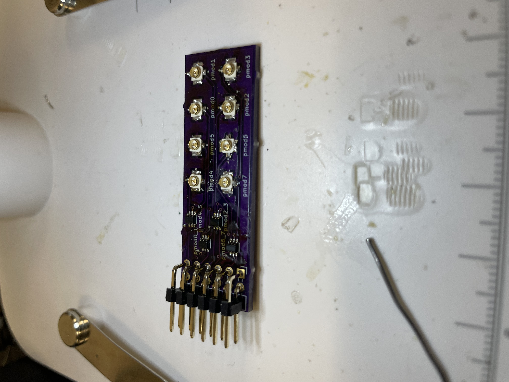
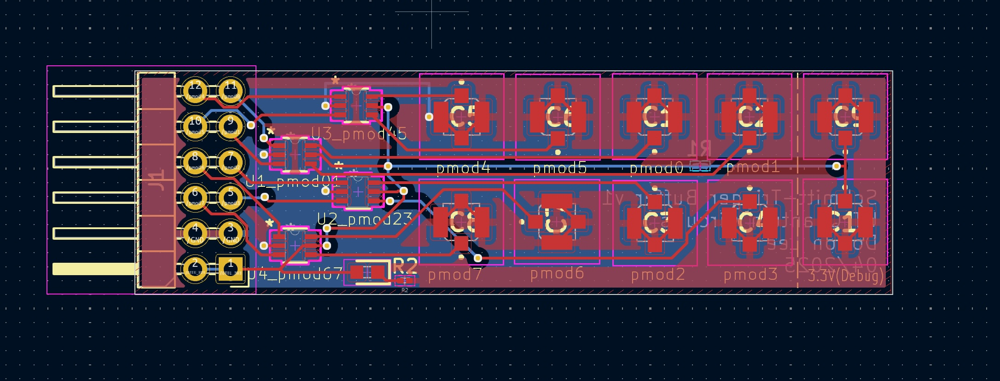
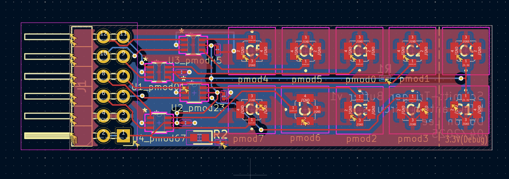

# Schmitt-Trigger-PCB

+ Problem: The RFSoC boards like ZCU216 & ZCU111 cannot drive 50 Ohm device on their pmod outputs due to their current limitations. The standard LVCMOS I/O banks can often handle 2-12 mA of current, but to drive a 50-Ohm load, about 66 mA is required.

+ Solution: The use of a buffer, particularly the dual Schmitt-Trigger buffer (SN74LVC2G17 from TI), allows a tolerance of 24 mA of current at 3.3 V, which enables it to drive the 50-Ohm load.
	- *Note: RF devices are typically 50-Ohm, but if using components with resistance less than 50 Ohms, Schmitt-Trigger buffer might be insufficient. In this case, make use of a level shifter or an Op-Amp.
	- Our group tried using an Op-Amp, but most of them required the use of an external power supply, so we continued with level converters or buffers.

+ Result: The Schmitt-Trigger buffer-mounted PCB was able to drive the RF switch (50 Ohms) but was not able to extend the qubit lifetime as with our intentions.
	- However, it is highly recommended for RFSoC users to use this kind of device on the pmod outputs of their boards.

# Parts
	- 1 Connector_PinHeader (2x06, 2.54 mm)
	- 4 Dual Schmitt-Trigger Buffer
	- 10 UMCC Connectors
	- 1 Power-On LED
	- 2 Resistors (470, 680 Ohms)
	- 4 Bypass Capacitors (0.1 uF)

# Design
### V1
+ Initial version with following parts:
	- 1 Connector_PinHeader (2x06, 2.54 mm)
		- Connection to the pmod pins of the RFSoC
	- 4 SN74LVC2G17DCKR Dual Schmitt-Trigger Buffer
		- [SN74LVC2G17 Data Sheet](./Data_Sheet/SN74LVC2G17.pdf)
		- Digital logic device (based on input voltage, the output is HIGH (Vcc = 3.3 V) or LOW (near GND))
		- Capable of driving more current
		- Filters noise and glitches
	- 8 UMCC connectors
		- [CONMHF1-SMD-G-T Data Sheet](./Data_Sheet/CONMHF1-SMD-G-T.pdf)
		- Allows the use of SMA connectors

### V2
+ Addition of the following parts:
	- 2 UMCC connectors
		- Debugging purpose where the connectors are basically connected to power (3.3 V)
	- 1 power-on LED and 1 resistor (470 Ohms)
		- LED: SMD 150060RS75000 [150060RS75000 Data Sheet](./Data_Sheet/SMD_LED_150060RS75000.pdf)
		- Resistor: SMD 0603 (imperial)
		- Resistance was chosen such that operating current is about 3-4 mA and operating voltage is about 1.45 V for optimal brightness vs. power dissipation vs. temperature
	- 1 resistor (680 Ohms)
		- SMD 0603 (imperial)
		- Isolation of 2 debug connectors from the power (3.3 V) node
		- Limit current

### V3
+ Addition of 4 bypass capacitors (0.1 uF) near the Vcc pins (3.3 V power) of the Schmitt-Trigger buffer as per the design recommendation by the manufacturer, Texas Instruments
	- Filters out high-frequency transients and some noise

# Soldering
